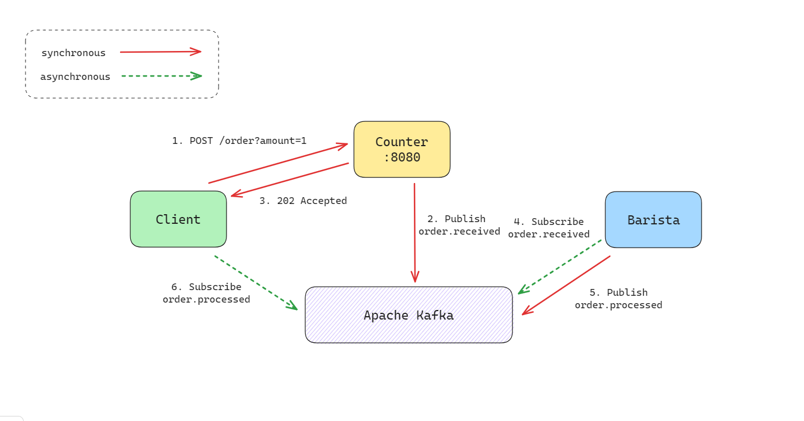

# Simple Event Driven Service With Apache Kafka

This is a simple event driven service with Apache Kafka mimic the behavior of a simple coffee shop.

## Requirements

- Docker and Docker Compose
- Go 1.21.0

## Service Architecture



## How to run

### 1. Start Kafka

```bash
$ docker-compose up -d
```

### 2. Start counter and barista

- use different terminal to run each service

```bash
$ go run ./cmd/counter
```

```bash
$ go run ./cmd/barista
```

### 3. Start client

- use `--c` flag to specify the number of customer

```bash
$ go run ./cmd/client --c 5
```

## Terminal Output

### Client

```bash
$ go run ./cmd/client/ --c 5
2023/10/15 15:27:29 Starting 5 clients
2023/10/15 15:27:29 Order accepted: f891847d-3749-4cda-9b69-8c1d1f521b69
2023/10/15 15:27:30 Order accepted: 5b75a75c-bd1c-429a-9a43-9e76c60e023b
2023/10/15 15:27:31 Order accepted: 27ebadd3-08d2-49cb-b589-5f2a3ae2b503
2023/10/15 15:27:32 Order accepted: 9d3136bd-d04c-41f1-b791-1b4539eca2d0
2023/10/15 15:27:33 Order accepted: a7398158-d289-4a67-914a-44094fe0712c
2023/10/15 15:27:34 Order ID f891847d-3749-4cda-9b69-8c1d1f521b69 is ready for pickup. Enjoy your coffee!
2023/10/15 15:27:35 Order ID 5b75a75c-bd1c-429a-9a43-9e76c60e023b is ready for pickup. Enjoy your coffee!
2023/10/15 15:27:36 Order ID 27ebadd3-08d2-49cb-b589-5f2a3ae2b503 is ready for pickup. Enjoy your coffee!
2023/10/15 15:27:37 Order ID 9d3136bd-d04c-41f1-b791-1b4539eca2d0 is ready for pickup. Enjoy your coffee!
2023/10/15 15:27:38 Order ID a7398158-d289-4a67-914a-44094fe0712c is ready for pickup. Enjoy your coffee!
```

### Counter

```bash
$ go run ./cmd/counter/
2023/10/15 15:27:14 Counter is ready to take orders
2023/10/15 15:27:14 Starting counter...
2023/10/15 15:27:29 Produced message to topic order.received [0] at offset 35
2023/10/15 15:27:30 Produced message to topic order.received [0] at offset 36
2023/10/15 15:27:31 Produced message to topic order.received [0] at offset 37
2023/10/15 15:27:32 Produced message to topic order.received [0] at offset 38
2023/10/15 15:27:33 Produced message to topic order.received [0] at offset 39
```

### Barista

```bash
$ go run ./cmd/barista/
2023/10/15 15:27:22 Barista is ready to take orders
2023/10/15 15:27:22 Barista is ready to deliver orders
2023/10/15 15:27:29 Order received: f891847d-3749-4cda-9b69-8c1d1f521b69
2023/10/15 15:27:30 Order received: 5b75a75c-bd1c-429a-9a43-9e76c60e023b
2023/10/15 15:27:31 Order received: 27ebadd3-08d2-49cb-b589-5f2a3ae2b503
2023/10/15 15:27:32 Order received: 9d3136bd-d04c-41f1-b791-1b4539eca2d0
2023/10/15 15:27:33 Order received: a7398158-d289-4a67-914a-44094fe0712c
2023/10/15 15:27:34 Order processed: f891847d-3749-4cda-9b69-8c1d1f521b69
2023/10/15 15:27:34 Delivered message to order.processed[0]@35
2023/10/15 15:27:35 Order processed: 5b75a75c-bd1c-429a-9a43-9e76c60e023b
2023/10/15 15:27:35 Delivered message to order.processed[0]@36
2023/10/15 15:27:36 Order processed: 27ebadd3-08d2-49cb-b589-5f2a3ae2b503
2023/10/15 15:27:36 Delivered message to order.processed[0]@37
2023/10/15 15:27:37 Order processed: 9d3136bd-d04c-41f1-b791-1b4539eca2d0
2023/10/15 15:27:37 Delivered message to order.processed[0]@38
2023/10/15 15:27:38 Order processed: a7398158-d289-4a67-914a-44094fe0712c
2023/10/15 15:27:38 Delivered message to order.processed[0]@39
```

## References

- [Confluent Documentation](https://docs.confluent.io/kafka-clients/go/current/overview.html)
- [Confluent Getting Started](https://developer.confluent.io/get-started/go/?_ga=2.172670048.2133526506.1697293182-1995088193.1697293182&_gl=1*lktbbm*_ga*MTk5NTA4ODE5My4xNjk3MjkzMTgy*_ga_D2D3EGKSGD*MTY5NzM0OTE4Ni42LjAuMTY5NzM0OTE4Ni42MC4wLjA.)
- [Inspired by this repo](https://github.com/thangchung/go-coffeeshop)